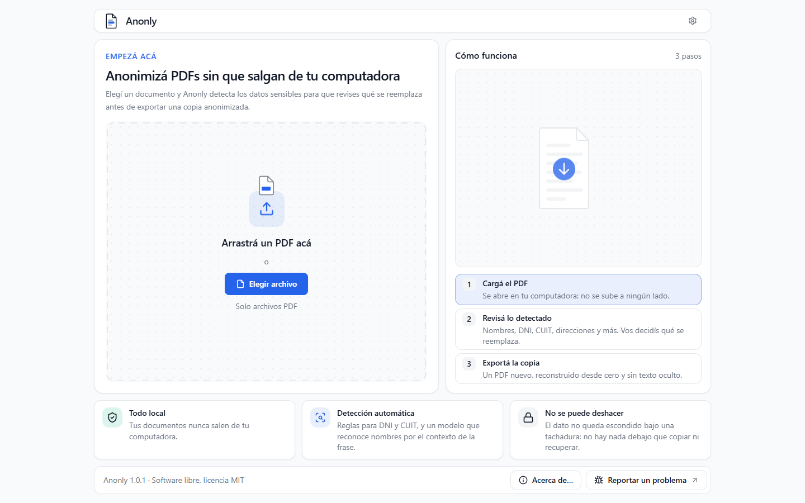
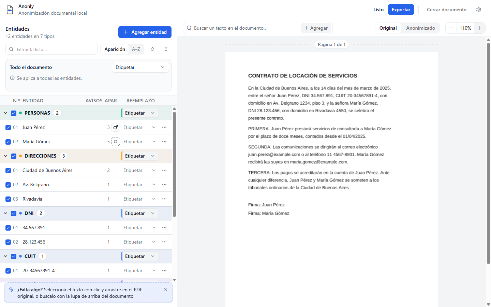
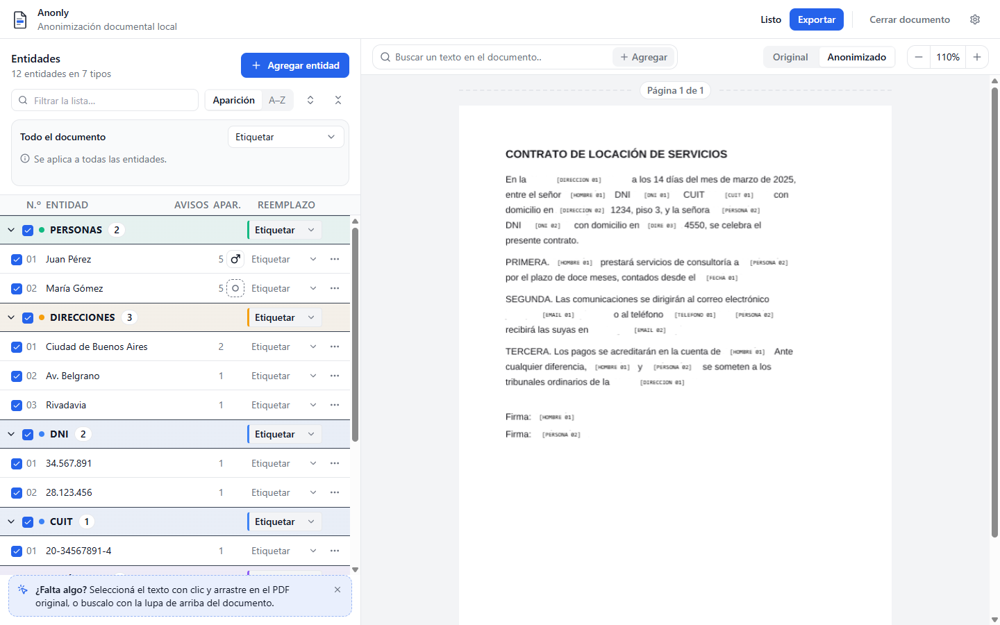

# Anonly

**Español** · [English](#anonly-english)

> Anonimizá documentos PDF sin que salgan de tu computadora.

Anonly es una aplicación de escritorio, libre y gratuita, para Windows y macOS. Encuentra los datos personales de un PDF —nombres, DNI, CUIT, direcciones, teléfonos, emails—, te deja revisar cada reemplazo y exporta un PDF nuevo en el que el dato original no se puede recuperar. Todo el análisis corre en tu equipo: no hay cuenta, ni servidor, ni telemetría.

[**Descargar la última versión**](https://github.com/sgiambelluca/Anonly/releases/latest) · Windows: `Anonly-Setup-<versión>.exe` · macOS: `Anonly-<versión>-universal.dmg`



## Para quién es

Para quien trabaja con documentos confidenciales y necesita compartirlos sin exponer a las personas que nombran: estudios jurídicos, peritos, personal de salud, recursos humanos, auditoría, periodismo, docencia. También para quien quiere usar un documento con una herramienta de IA sin entregarle los datos reales.

Los servicios en línea obligan a subir el documento a un servidor. Tapar con un rectángulo negro deja el texto adentro del archivo. Anonly no hace ninguna de las dos cosas.

## Cómo funciona

1. **Cargás el PDF.** Con texto o escaneado: si es una imagen, lo lee con OCR en tu computadora.
2. **Revisás lo detectado.** Las apariciones de un mismo dato se agrupan en una sola entidad. Elegís cómo reemplazar cada una —un marcador como `[PERSONA 01]`, un valor ficticio, una máscara o un tachado—, corregís lo que haga falta y agregás a mano lo que se haya escapado.
3. **Exportás la copia.** Un PDF nuevo, reconstruido desde cero como imagen, sin el texto ni los metadatos del original.

| Original | Anonimizado |
|---|---|
|  |  |

Las capturas usan un documento ficticio.

## Privacidad

- **Tus documentos no salen de tu computadora.** Se procesan en memoria y no se guardan copias. El único archivo que la aplicación escribe es el PDF anonimizado, donde vos elegís.
- **Una sola conexión a internet**: preguntarle a GitHub si hay una versión nueva. GitHub ve tu IP y la versión que tenés instalada, nada más. Se puede apagar desde Configuración → Actualizaciones → «No buscar».
- **El motor de anonimización no tiene acceso a la red**, y un control automático del proyecto lo verifica sobre el código en cada cambio.
- **Las actualizaciones se verifican** con una clave propia del proyecto antes de instalarse.

El detalle está en [`PRIVACY.md`](./PRIVACY.md).

## Instalación

**Requisitos**: Windows 10 u 11 de 64 bits, o macOS (Apple Silicon o Intel). **8 GB de RAM** como mínimo: un documento escaneado largo puede usar unos 3 GB mientras se procesa. El instalador pesa entre 250 y 370 MB, según el sistema, porque lleva adentro los modelos de detección; después de instalar, la aplicación funciona sin conexión.

La primera vez, el sistema operativo va a mostrar una advertencia, porque la aplicación todavía no tiene certificados comerciales de firma:

- **Windows** muestra «editor desconocido» (SmartScreen). Elegí «Más información» y después «Ejecutar de todas formas».
- **macOS** bloquea la primera apertura. Permitila desde Ajustes del Sistema → Privacidad y seguridad.

Cada versión publica el SHA-256 de sus archivos y una atestación que ata cada instalador al commit que lo construyó. Cómo verificarlos: [`CODE_SIGNING.md`](./CODE_SIGNING.md).

## Limitaciones conocidas

Ninguna herramienta automática encuentra todo. **Revisá siempre el documento anonimizado antes de compartirlo.**

- En una página escaneada con muy poco texto y girada, la lectura puede fallar sin aviso.
- En escaneos de baja resolución se pueden escapar direcciones de email.
- Las direcciones postales y los nombres en formas poco comunes (todo en mayúsculas, apellido primero) pueden no detectarse.
- El número de expediente judicial no se detecta automáticamente.
- Solo PDF, por ahora. La interfaz está solo en español.

La lista completa está en [`docs/roadmap/Version_1.0.md`](./docs/roadmap/Version_1.0.md), y lo que viene en [`docs/roadmap/Roadmap_1.x.md`](./docs/roadmap/Roadmap_1.x.md).

## Para desarrollar

**Requisitos**: Node ≥ 22 y pnpm ≥ 9. Funciona nativo en Windows, macOS y Linux.

```bash
pnpm install
```

Los modelos y los binarios de OCR no se versionan: se bajan de sus orígenes fijados y se verifican por hash contra `assets.lock.json`. Sin este paso la aplicación arranca pero no detecta nombres ni lee escaneados.

```bash
pnpm assets:mirror
```

```bash
pnpm dev
```

Antes de abrir un PR:

```bash
pnpm lint && pnpm typecheck && pnpm test && pnpm test:contract && pnpm format:check
```

El repositorio es un monorepo de pnpm con tres partes: `packages/anonymization-core/` (el motor: siete módulos independientes que se comunican por eventos), `apps/react-client/` (la interfaz) y `apps/desktop-shell/` (el contenedor Electron y el actualizador). La tabla completa de comandos y gates está en [`docs/architecture/07_Performance_Strategy.md`](./docs/architecture/07_Performance_Strategy.md) §11.4.

### Contribuir

Los cambios llegan por pull request desde un fork, y los revisa y mergea el mantenedor. Las reglas del proyecto son estrictas a propósito; las principales:

- Un commit toca un solo módulo.
- Los contratos públicos de `docs/core/Contracts.md` no se rompen, y una decisión técnica no trivial se escribe como ADR antes de implementarse.
- TypeScript estricto, y todo cambio trae sus tests.
- Nunca se commitean datos de un documento real.

El detalle está en [`docs/ai/AI_Development_Guide.md`](./docs/ai/AI_Development_Guide.md) y [`docs/ai/Code_Standards.md`](./docs/ai/Code_Standards.md). El proyecto se desarrolla con asistencia de IA bajo un esquema de planificador, implementador y revisor: [`CLAUDE.md`](./CLAUDE.md).

Para reportar una vulnerabilidad: [`SECURITY.md`](./SECURITY.md).

## Documentación

| Tema | Dónde |
|---|---|
| Visión del producto | [`docs/00_Project_Vision.md`](./docs/00_Project_Vision.md) |
| Arquitectura, pipeline y modelo de seguridad | [`docs/architecture/`](./docs/architecture/) |
| Contratos y especificación de cada motor | [`docs/core/`](./docs/core/) |
| Interfaz | [`docs/ui/`](./docs/ui/) |
| Decisiones (ADR) | [`docs/adr/`](./docs/adr/) |
| Roadmap | [`docs/roadmap/`](./docs/roadmap/README.md) |

## Licencia y créditos

Anonly es software libre bajo licencia [MIT](./LICENSE).

El léxico usado para sugerir el género de los reemplazos de personas incorpora datos derivados de «Nombres» (Buenos Aires Data, CC-BY-2.5-AR). La atribución completa, y la lista del software y los modelos de terceros que el instalador distribuye, están en [`NOTICE`](./NOTICE) y en el diálogo «Acerca de» de la aplicación.

---

# Anonly (English)

[Español](#anonly) · **English**

> Anonymize PDF documents without them ever leaving your computer.

Anonly is a free, open source desktop application for Windows and macOS. It finds the personal data in a PDF (names, national ID and tax numbers, addresses, phone numbers, emails), lets you review every replacement, and exports a new PDF in which the original data cannot be recovered. All the analysis runs on your machine: there is no account, no server and no telemetry.

[**Download the latest version**](https://github.com/sgiambelluca/Anonly/releases/latest) · Windows: `Anonly-Setup-<version>.exe` · macOS: `Anonly-<version>-universal.dmg`

**The interface is in Spanish only for now**, and the built-in patterns target Argentine document formats (DNI, CUIT, local phone numbers and license plates).

## Who it is for

People who handle confidential documents and need to share them without exposing the individuals they name: law firms, court experts, health staff, HR, auditing, journalism, teaching. It also helps when you want to use a document with an AI tool without handing over the real data.

Online services require uploading the document to a server. Covering text with a black rectangle leaves it inside the file. Anonly does neither.

## How it works

1. **Load the PDF.** Text-based or scanned: images are read with OCR on your computer.
2. **Review what was found.** Every occurrence of the same value is grouped into one entity. You choose how to replace each one (a marker such as `[PERSONA 01]`, a fictitious value, a mask or a redaction), correct what needs correcting, and add by hand anything that was missed.
3. **Export the copy.** A new PDF, rebuilt from scratch as images, without the text or the metadata of the original.

See the screenshots [above](#cómo-funciona); they use a fictitious document.

## Privacy

- **Your documents never leave your computer.** They are processed in memory and no copies are kept. The only file the application writes is the anonymized PDF, wherever you choose.
- **A single internet connection**: asking GitHub whether a new version exists. GitHub sees your IP address and the version you have installed, nothing else. You can turn it off under Configuración → Actualizaciones → «No buscar».
- **The anonymization engine has no network access**, and an automated project check enforces that on the code with every change.
- **Updates are verified** with a project key before they are installed.

Details: [`PRIVACY.md`](./PRIVACY.md).

## Installation

**Requirements**: 64-bit Windows 10 or 11, or macOS (Apple Silicon or Intel). At least **8 GB of RAM**: a long scanned document can use around 3 GB while it is processed. The installer is between 250 and 370 MB, depending on the system, because it bundles the detection models; once installed, the application works offline.

On first launch the operating system shows a warning, because the application does not have commercial signing certificates yet:

- **Windows** shows an "unknown publisher" notice (SmartScreen). Choose "More info", then "Run anyway".
- **macOS** blocks the first launch. Allow it under System Settings → Privacy & Security.

Every release publishes the SHA-256 of its files and a build attestation that ties each installer to the commit that produced it. How to verify them: [`CODE_SIGNING.md`](./CODE_SIGNING.md).

## Known limitations

No automated tool finds everything. **Always review the anonymized document before sharing it.**

- On a scanned page with very little text that is also rotated, reading can fail without a warning.
- Email addresses can be missed in low-resolution scans.
- Postal addresses and names in uncommon forms (all capitals, surname first) may go undetected.
- Court case numbers are not detected automatically.
- PDF only, for now.

The full list is in [`docs/roadmap/Version_1.0.md`](./docs/roadmap/Version_1.0.md) and what comes next in [`docs/roadmap/Roadmap_1.x.md`](./docs/roadmap/Roadmap_1.x.md) (both in Spanish).

## Development

**Requirements**: Node ≥ 22 and pnpm ≥ 9. Runs natively on Windows, macOS and Linux.

```bash
pnpm install
```

Models and OCR binaries are not versioned: they are downloaded from pinned sources and verified by hash against `assets.lock.json`. Without this step the application starts but does not detect names or read scans.

```bash
pnpm assets:mirror
```

```bash
pnpm dev
```

Before opening a pull request:

```bash
pnpm lint && pnpm typecheck && pnpm test && pnpm test:contract && pnpm format:check
```

The repository is a pnpm monorepo with three parts: `packages/anonymization-core/` (the engine: seven independent modules that communicate through events), `apps/react-client/` (the interface) and `apps/desktop-shell/` (the Electron container and the updater).

### Contributing

Changes arrive as pull requests from a fork and are reviewed and merged by the maintainer. The project rules are strict on purpose. The main ones:

- A commit touches a single module.
- The public contracts in `docs/core/Contracts.md` are not broken, and any non-trivial technical decision is written as an ADR before it is implemented.
- Strict TypeScript, and every change comes with its tests.
- Data from a real document is never committed.

Details are in [`docs/ai/AI_Development_Guide.md`](./docs/ai/AI_Development_Guide.md) and [`docs/ai/Code_Standards.md`](./docs/ai/Code_Standards.md). The documentation is written in Spanish. The project is developed with AI assistance under a planner, implementer and reviewer scheme: [`CLAUDE.md`](./CLAUDE.md).

To report a vulnerability: [`SECURITY.md`](./SECURITY.md).

## License and credits

Anonly is free software under the [MIT](./LICENSE) license.

The lexicon used to suggest the gender of person replacements includes data derived from "Nombres" (Buenos Aires Data, CC-BY-2.5-AR). Full attribution, and the list of third-party software and models the installer distributes, are in [`NOTICE`](./NOTICE) and in the application's «Acerca de» (About) dialog.
