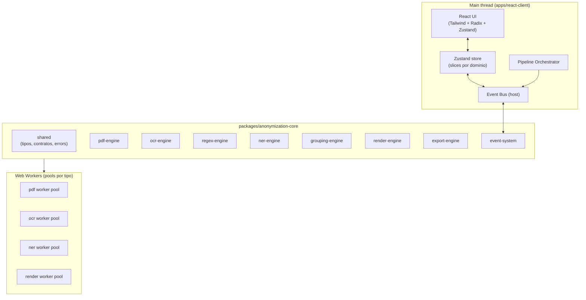
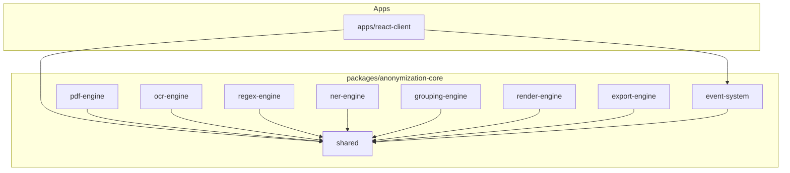
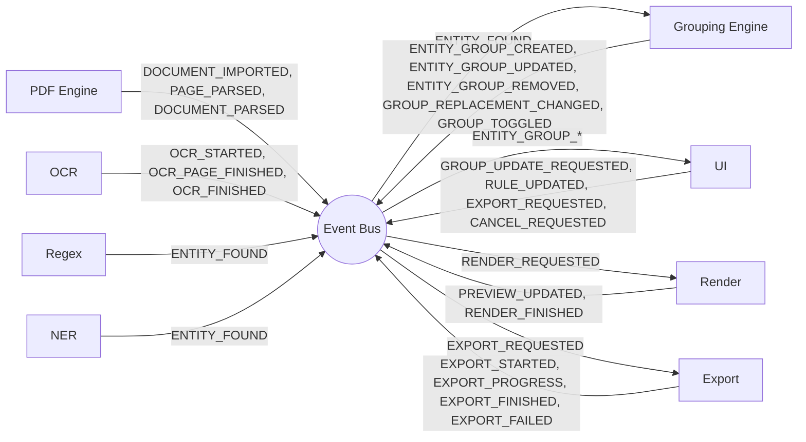
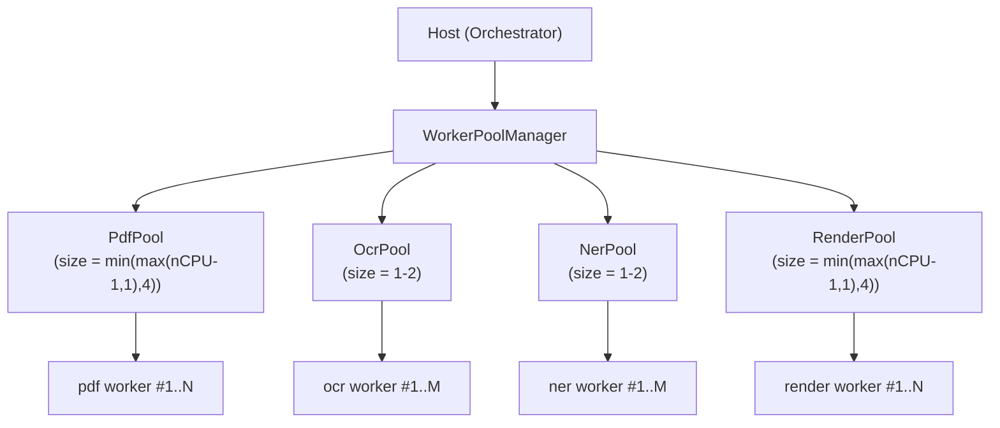
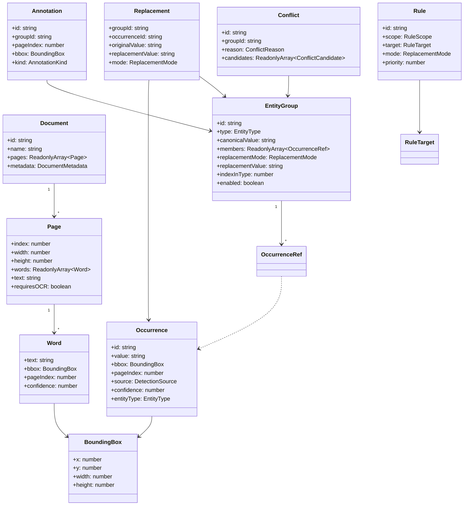
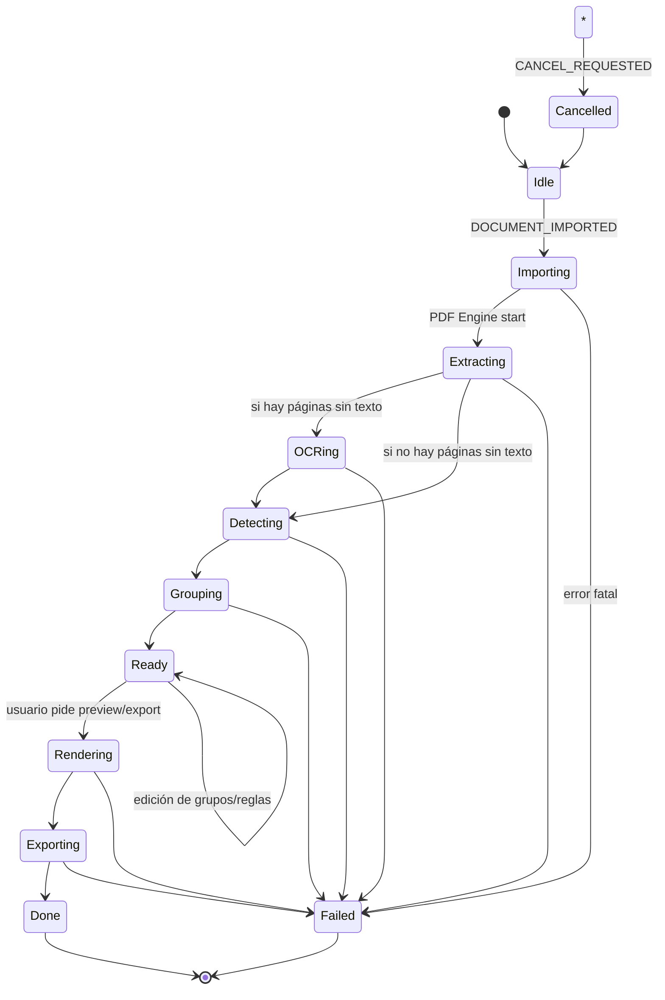
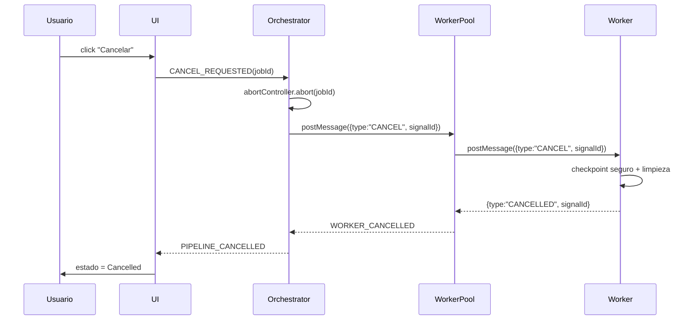
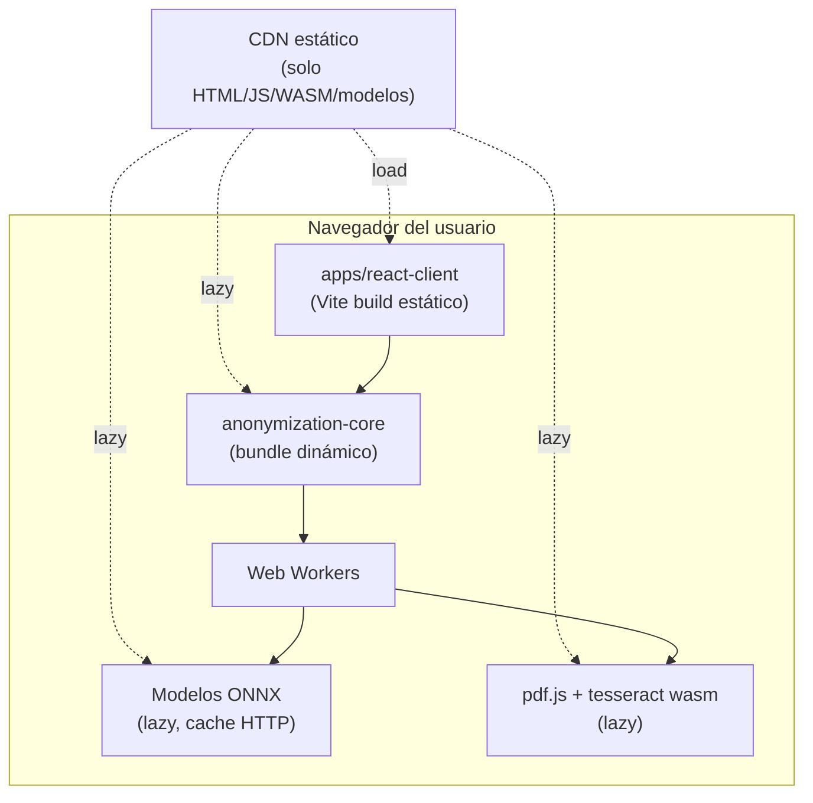

<!-- CONTEXT: scope=diagramas | dependencias=01_Technical_Architecture_Document.md,03_Data_Model.md,04_Event_System.md | audiencia=humanos+IA | fase=1 -->

# Anonly — Diagramas del Sistema

> Apéndice visual del TAD (bloque 3 ampliado). Todos los diagramas están en Mermaid o ASCII para que sean consumibles por IA y versionables como texto. Sin imágenes binarias.

---

## 1. Diagrama de capas



ASCII equivalente:

```
┌──────────────────────────────────────────────────────────┐
│ apps/react-client (main thread)                          │
│   UI ─► Zustand store ─► Event Bus ─► Orchestrator       │
└──────────────────────────┬───────────────────────────────┘
                           │ eventos tipados
┌──────────────────────────┴───────────────────────────────┐
│ packages/anonymization-core                              │
│   shared · event-system · pdf · ocr · regex · ner ·      │
│   grouping · render · export                             │
└──────────────────────────┬───────────────────────────────┘
                           │ postMessage + Transferable
┌──────────────────────────┴───────────────────────────────┐
│ Web Workers (pool por tipo de engine)                    │
└──────────────────────────────────────────────────────────┘
```

---

## 2. Diagrama de pipeline

```mermaid
flowchart LR
  A[PDF ArrayBuffer] --> B[PDF Engine]
  B --> C[OCR Engine\n(solo páginas sin texto)]
  C --> D[Normalización\n(dentro de shared)]
  D --> E[Regex Engine]
  E --> F[NER Engine]
  F --> G[Grouping Engine]
  G --> H[Conflictos\n(dentro de grouping)]
  H --> I[Vista previa\n(Render Engine parcial)]
  I --> J[Edición de grupos/reglas\n(UI)]
  J --> K[Render Engine\n(completo)]
  K --> L[Export Engine]
  L --> M[PDF nuevo]
```

Cada etapa: entra, sale, eventos emitidos y errores en `06_Pipeline.md`.

---

## 3. Diagrama de paquetes y dependencias permitidas



**Invariante**: ningún motor apunta a otro motor. Sin flechas `PDF --> Group`, `NER --> Group`, etc. La comunicación es por eventos, no por imports. Validado por regla de ESLint `no-restricted-imports` en `ai/Code_Standards.md`.

---

## 4. Diagrama de eventos (maestro)

Mapa alto nivel. Tabla exhaustiva en `04_Event_System.md`.



Convención: `ENTITY_FOUND` es **interno** entre detectores y grouping. La UI se suscribe a `ENTITY_GROUP_*`, nunca a `ENTITY_FOUND`.

---

## 5. Diagrama de Workers y pools



Mensajes, timeouts, cancelación, reintentos, colas y prioridades en `05_Worker_Architecture.md`.

---

## 6. Diagrama de modelo de datos



Definición de cada tipo, atributo e invariante en `03_Data_Model.md`.

---

## 7. Diagrama de estado del pipeline



---

## 8. Diagrama de cancelación



Requisito: el cese de CPU del worker debe ocurrir en < 200 ms desde el input del usuario (ver `07_Performance_Strategy.md`).

---

## 9. Diagrama de despliegue



**Sin backend de procesamiento.** El CDN solo sirve assets estáticos. No hay endpoint que reciba documentos. (Ver `adr/ADR-002-No-Backend.md` y `08_Security_Model.md`.)

---

## 10. Convenciones de los diagramas

- Mermaid para grafos y secuencias; ASCII para layouts muy tabulares.
- Nombres de nodos en español o inglés según el concepto (capas en inglés, eventos en UPPER_SNAKE).
- Cada diagrama declara su fuente de verdad en la primera línea.
- No duplicar lógica: si un diagrama contradice un apéndice, el apéndice gana y el diagrama se corrige.
