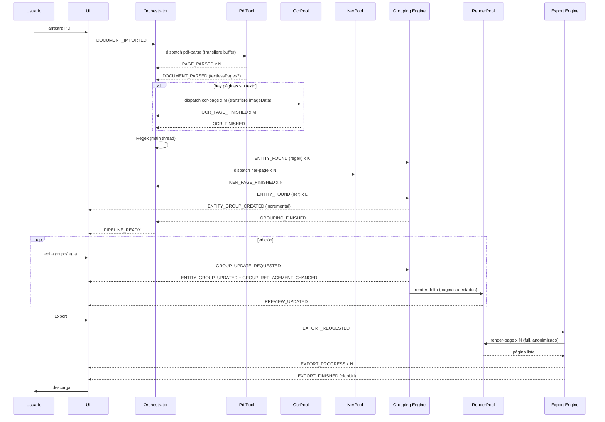

<!-- CONTEXT: scope=pipeline | dependencias=03_Data_Model.md,04_Event_System.md,05_Worker_Architecture.md | audiencia=IA+humanos | fase=1 -->

# Anonly — Pipeline (TAD bloque 6)

> Define el ciclo de vida completo de un documento dentro del sistema. Cada etapa declara: **entra**, **sale**, **eventos emitidos**, **errores**, **cancelación** y **métricas**. Es la columna vertebral del orquestador.

**Principio**: incremental y cancelable en cualquier etapa (principios A-12 del TAD).

---

## 1. Visión general

```
0. Documento recibido
        │
1. Extracción (PDF Engine)
        │
2. OCR (OCR Engine, solo páginas sin texto)
        │
3. Normalización (shared)
        │
4. Regex (Regex Engine)
        │
5. NER (NER Engine)
        │
6. Agrupación (Grouping Engine)
        │
7. Conflictos (Grouping Engine)
        │
8. Vista previa (Render Engine, parcial)
        │
9. Edición de grupos/reglas (UI)
        │
10. Render completo (Render Engine)
        │
11. Exportación (Export Engine)
```

Las etapas 1–7 son automáticas. La 8 es automática pero parcial. La 9 es interactiva. Las 10–11 son bajo demanda del usuario.

---

## 2. Etapa 0 — Documento recibido

**Entra**: `File | ArrayBuffer` + nombre.
**Sale**: `DOCUMENT_IMPORTED` evento.
**Eventos emitidos**: `DOCUMENT_IMPORTED`.
**Errores**: si el archivo no es un PDF, no se emite `DOCUMENT_IMPORTED` y la UI muestra error local.
**Cancelación**: no aplica (sincrono).
**Métricas**: `sizeBytes`, `importedAt`.

Notas: el archivo se lee como `ArrayBuffer` en el main thread y se mantiene en memoria hasta `DOCUMENT_CLOSED`. No se persiste.

---

## 3. Etapa 1 — Extracción (PDF Engine)

**Entra**: `{ documentId, buffer, password? }` → `PdfPool.dispatch({ type: "pdf-parse", payload })`. El `buffer` se **transfiere** (zero-copy). Lo transferido es una **copia**: el Orchestrator retiene el `ArrayBuffer` original de la etapa 0 para alimentar después `RenderEngine.loadDocument` (ADR-030).
**Sale**: `DocumentModel` con `Page[]` (con `Word[]` y `BoundingBox`), `textlessPages: number[]`, `sourceKind`.
**Eventos emitidos**: `PAGE_PARSED` (por página), `DOCUMENT_PARSED`, `PDF_PASSWORD_REQUIRED`, `PDF_INVALID`.
**Errores**:
- `PDF_PASSWORD_REQUIRED` → recuperable: UI pide password, se reenvía con `password`.
- `PDF_INVALID` → no recuperable: `PIPELINE_FAILED`.
- Timeout por página → reintento (1) → `PDF_INVALID`.
**Cancelación**: entre páginas, SLA < 200 ms.
**Métricas**: `pageCount`, `wordCount`, `durationMs` por página y total, `textlessRatio = textlessPages.length / pageCount`.
**Etapa siguiente**: si `textlessPages.length > 0` → Etapa 2. Si no → Etapa 3.

---

## 4. Etapa 2 — OCR (OCR Engine)

**Entra**: para cada `pageIndex ∈ textlessPages`, el host rasteriza la página con PDF.js a `ImageData` (en el main thread usando OffscreenCanvas o en un RenderWorker ligero) y dispatcha `OcrPool.dispatch({ type: "ocr-page", payload: { documentId, pageIndex, imageData, dpi, languages } })`. `imageData` se transfiere.
**Sale**: `Word[]` por página con `confidence` y `source: "ocr"`. El PDF Engine fusiona esas palabras en `Page.words` (vía `OCR_PAGE_FINISHED`).
**Eventos emitidos**: `OCR_STARTED`, `OCR_PAGE_FINISHED`, `OCR_FINISHED`, `OCR_PAGE_FAILED`.
**Errores**:
- `OCR_PAGE_FAILED` → reintentable hasta `maxRetries = 2`. Si agota, esa página queda con `requiresOCR = true` y `ocrCompleted = false`; las detecciones posteriores se saltan sus ocurrencias (warning al usuario).
- Timeout por página → reintento (2) → `OCR_PAGE_FAILED`.
**Cancelación**: entre líneas reconocidas (Tesseract expone progreso), SLA < 200 ms.
**Métricas**: `pagesProcessed`, `avgConfidence`, `durationMs` por página y total.
**Etapa siguiente**: Etapa 3.

**Optimización**: las páginas se procesan en paralelo respetando el tamaño del `OcrPool`. La cola prioriza las páginas visibles en la UI (ver `05_Worker_Architecture.md` §6.2).

---

## 5. Etapa 3 — Normalización (shared)

**Entra**: `Page.text` y `Page.words` ya fusionados (PDF + OCR).
**Sale**: texto normalizado por página + `normalizedValue` precomputado para detección.
**Eventos emitidos**: ninguno (etapa interna síncrona en shared).
**Errores**: ninguno esperado.
**Cancelación**: entre páginas.
**Métricas**: `durationMs` total (debe ser < 5% del total del pipeline).

**Normalización aplicada**:
- Unicode NFC.
- Strip de espacios múltiples y de control chars.
- Preservación de mayúsculas/minúsculas (la comparación se hace en `normalizedValue` con lowercase + strip de puntuación redundante, pero el `value` original se conserva).
- Normalización de separadores decimales en CUIT/DNI (puntos y guiones estandarizados para comparar).

**Etapa siguiente**: Etapa 4.

---

## 6. Etapa 4 — Regex (Regex Engine)

**Entra**: `DocumentModel` con páginas y texto.
**Sale**: stream de `Occurrence[]` con `source: "regex"`, `confidence: 1.0`, `entityType` según el patrón matcheado.
**Eventos emitidos**: `ENTITY_FOUND` (por ocurrencia, **interno**), `REGEX_FINISHED`.
**Errores**: ninguno esperado (es determinista). Si un patrón custom del usuario es inválido, se descarta con warning y se continúa.
**Cancelación**: entre páginas, SLA < 200 ms.
**Métricas**: `occurrenceCount` por tipo, `durationMs`.

**Patrones default** (ver `core/Regex_Engine.md` para los regex exactos):
- DNI (AR): `\b\d{1,2}\.?\d{3}\.?\d{3}\b`
- CUIT/CUIL (AR): `\b\d{2}-?\d{8}-?\d\b`
- Teléfono (AR): mobile y landline, con/sin +54
- Email: RFC 5322 simplificado
- IBAN: `\b[A-Z]{2}\d{2}[A-Z0-9]{10,30}\b`
- Tarjeta: Luhn-validating, 13–19 dígitos con separadores opcionales
- Fecha: `\b\d{1,2}[/-]\d{1,2}[/-]\d{2,4}\b` (con normalización de ambigüedad DD/MM vs MM/DD → se asume DD/MM para AR)
- Matrícula profesional: patrón AR específico
- Patente: AR vieja y nueva (Mercosur)

**Etapa siguiente**: Etapa 5 (NER) en paralelo con el inicio de la 6 (Grouping puede ir agrupando ocurrencias Regex mientras NER corre, porque `ENTITY_FOUND` es unificado).

---

## 7. Etapa 5 — NER (NER Engine)

**Entra**: `Page.text` por página.
**Sale**: stream de `Occurrence[]` con `source: "ner"`, `entityType ∈ {Person, Organization, Address, Date}` (ADR-023 §2), `confidence` según el modelo.
**Eventos emitidos**: `NER_STARTED`, `NER_MODEL_LOADING`, `NER_MODEL_READY`, `ENTITY_FOUND` (interno), `NER_PAGE_FINISHED`, `NER_FINISHED`.
**Errores**:
- `NER_MODEL_MISSING` → no recuperable en runtime; la UI debe ofrecer descargar el modelo o desactivar NER.
- `NER_PAGE_FAILED` → reintentable 1 vez; si agota, se descartan ocurrencias NER de esa página (las Regex se mantienen).
- Timeout por página → reintento (1) → descartar.
**Cancelación**: entre batches de inferencia, SLA < 200 ms.
**Métricas**: `occurrenceCount`, `avgConfidence`, `modelId`, `durationMs` por página.

**Etapa siguiente**: Etapa 6. NER termina antes que Grouping (Grouping espera `REGEX_FINISHED` + `NER_FINISHED` antes de emitir `GROUPING_FINISHED`, pero va creando grupos incrementales a medida que llegan `ENTITY_FOUND`).

---

## 8. Etapa 6 — Agrupación (Grouping Engine)

**Entra**: stream de `Occurrence` vía `ENTITY_FOUND`.
**Sale**: `EntityGroup[]` con `indexInType` secuencial por tipo, `canonicalValue`, `aliases`, `members`.
**Eventos emitidos**: `ENTITY_GROUP_CREATED`, `ENTITY_GROUP_UPDATED`, `ENTITY_GROUP_REMOVED`, `GROUPING_FINISHED`.
**Errores**: ninguno esperado. Si dos grupos deben fusionarse (decisión del usuario), se emite `ENTITY_GROUP_UPDATED` y `ENTITY_GROUP_REMOVED`.
**Cancelación**: entre grupos procesados, SLA < 200 ms.
**Métricas**: `groupCount` por tipo, `occurrenceCount` total, `durationMs`.

**Algoritmo**:
1. Para cada `Occurrence`, se busca un grupo existente del mismo `entityType` cuyo `normalizedValue` de algún `alias` coincida exactamente con `occurrence.normalizedValue`. Si se encuentra, se agrega.
2. Si no hay coincidencia exacta, se busca por similitud fuzzy (Levenshtein normalizado) con umbral `GROUPING_SIMILARITY_THRESHOLD = 0.88`. Si se encuentra, se agrega como alias y se actualiza `canonicalValue` (el más frecuente o el más largo).
3. Si no hay match, se crea un grupo nuevo con `indexInType = nextIndex(type)`.
4. `canonicalValue` = el alias con mayor frecuencia; en empate, el más largo (más informativo).

**`indexInType`** es **provisional** durante el procesamiento incremental (orden de llegada de `ENTITY_FOUND`) y se **renumera canónicamente una sola vez en `finishSession`**, antes de emitir `GROUPING_FINISHED`, por orden de primera aparición documental (`pageIndex` asc, luego `bbox.y` asc, luego `bbox.x` asc) — así el resultado final es determinístico sin importar el orden de llegada (ADR-028). Tras la renumeración es estable por sesión: si un grupo se elimina, su índice **no** se reasigna (se saltea). Si dos grupos se fusionan, el resultante conserva el menor `indexInType` y el otro se libera. Export corre después de `GROUPING_FINISHED`, así que siempre ve índices canónicos.

**Etapa siguiente**: Etapa 7.

---

## 9. Etapa 7 — Conflictos (Grouping Engine)

**Entra**: `EntityGroup[]` + `Occurrence[]` con sus `source` y `bbox`.
**Sale**: `Conflict[]`.
**Eventos emitidos**: `CONFLICT_DETECTED`, `CONFLICT_RESOLVED`.
**Errores**: ninguno.
**Cancelación**: no aplica (síncrono, rápido).
**Métricas**: `conflictCount` por `reason`.

**Tipos de conflicto** (ver `03_Data_Model.md` §15):
- `overlap`: dos `Occurrence` de distintos `entityType` comparten bbox (intersección > 50%).
- `disagree`: Regex y NER asignan tipos distintos al mismo span.
- `low_confidence`: NER con `confidence < NER_CONFIDENCE_THRESHOLD = 0.7`.
- `ambiguous_canonical`: varios aliases con misma frecuencia; `canonicalValue` se elige arbitrariamente y se marca conflicto para que el usuario confirme.

**Resolución default automática** (no bloqueante, marcable por el usuario):
- `overlap`: gana el de mayor `confidence` y, en empate, el de `source: "regex"` (determinístico).
- `disagree`: gana Regex.
- `low_confidence`: se descarta la ocurrencia NER (no se agrupa).
- `ambiguous_canonical`: se mantiene el arbitrario.

El usuario puede overridear cualquiera desde la UI, emitiendo `CONFLICT_RESOLVE_REQUESTED`.

**Etapa siguiente**: Etapa 8.

---

## 10. Etapa 8 — Vista previa parcial (Render Engine)

**Entra**: `Document` + `EntityGroup[]` + `Annotation[]` + PDF fuente: antes del primer render, el Orchestrator carga los bytes retenidos en la etapa 0 vía `RenderEngine.loadDocument(documentId, buffer)` (una sola vez por documento; ADR-030).
**Sale**: `canvasBlobUrl` por página visible en la UI (original + anonimizado).
**Eventos emitidos**: `PREVIEW_UPDATED` (por página), `PREVIEW_PAGE_FAILED`.
**Errores**: `PREVIEW_PAGE_FAILED` → reintento (1) → se muestra placeholder en la UI.
**Cancelación**: entre páginas.
**Métricas**: `pagesRendered`, `durationMs` por página.

**Estrategia**:
- Solo se renderizan las páginas visibles en el viewport + 1 página antes y después (preemptive).
- Se renderiza primero el lado "original" (más rápido, sin reemplazos) y luego el "anonimizado".
- Cuando el usuario edita un grupo, se re-renderizan solo las páginas que tienen `members` de ese grupo (delta render).
- Ver `07_Performance_Strategy.md` para virtualización.

**Etapa siguiente**: Etapa 9 (interactiva, puede durar indefinidamente).

---

## 11. Etapa 9 — Edición de grupos/reglas (UI)

**Entra**: input del usuario vía eventos del canal `ui`.
**Sale**: mutaciones de `EntityGroup` y `Rule` (con copia estructural), re-render delta.
**Eventos emitidos (UI → Core)**: `GROUP_UPDATE_REQUESTED`, `GROUP_MERGE_REQUESTED`, `GROUP_SPLIT_REQUESTED`, `RULE_CREATED`, `RULE_UPDATED`, `RULE_DELETED`, `CONFLICT_RESOLVE_REQUESTED`.
**Eventos emitidos (Core → UI)**: `ENTITY_GROUP_UPDATED`, `GROUP_REPLACEMENT_CHANGED`, `GROUP_TOGGLED`, `CONFLICT_RESOLVED`, `PREVIEW_UPDATED` (delta).
**Errores**: si el `groupId` referenciado no existe, el Orchestrator descarta el evento con warning. Si el `patch` viola invariantes del `EntityGroup`, se rechaza con error tipado.
**Cancelación**: no aplica.
**Métricas**: `editsCount`, `timeToFirstExport` (UX).

**Etapa siguiente**: Etapa 10 cuando el usuario dispara `EXPORT_REQUESTED` (no antes, porque el usuario puede seguir editando).

---

## 12. Etapa 10 — Render completo (Render Engine)

**Entra**: `Document` + `EntityGroup[]` (enabled) + `Replacement[]` resueltos. El PDF fuente ya está cargado en Render desde la etapa 8 (`loadDocument`; ADR-030).
**Sale**: `ImageData` o `ArrayBuffer` PNG por página, lista para ensamblar en el Export Engine.
**Eventos emitidos**: `RENDER_FINISHED`, `RENDER_FAILED`.
**Errores**: `RENDER_FAILED` → reintento (1) → `EXPORT_FAILED`.
**Cancelación**: entre páginas, SLA < 200 ms.
**Métricas**: `pagesRendered`, `durationMs` total.

**Etapa siguiente**: Etapa 11.

---

## 13. Etapa 11 — Exportación (Export Engine)

**Entra**: `EncodedPageImage[]` (imágenes codificadas de páginas anonimizadas, obtenidas vía `RenderPageProvider`; ADR-032 §1) + `ExportMetadata` (mínima, sanitizada).
**Sale**: `ArrayBuffer` del PDF nuevo (transferido de vuelta al host) + `blobUrl` para descarga.
**Eventos emitidos**: `EXPORT_STARTED`, `EXPORT_PROGRESS`, `EXPORT_FINISHED`, `EXPORT_FAILED`.
**Errores**:
- `EXPORT_FAILED` → reintento (1) → `PIPELINE_FAILED`.
- `EXPORT_NO_ENABLED_GROUPS` → warning al usuario: "no hay grupos habilitados, el export será idéntico al original". No bloqueante (puede ser legítimo si el usuario desactivó todo).
**Cancelación**: entre páginas, SLA < 200 ms.
**Métricas**: `pagesExported`, `sizeBytes`, `durationMs`.

**Garantía de no recuperabilidad**:
- El PDF final se reconstruye desde cero con pdf-lib sobre las imágenes renderizadas.
- No se conserva ninguna capa de texto del original.
- No se conserva metadata sensible del original (ver `08_Security_Model.md`).
- No se conservan bookmarks, JavaScript embebido, ni forms del original (se descartan).

**Etapa siguiente**: `Done`. El documento sigue cargado para más ediciones/exports.

---

## 14. Matriz de etapas vs workers

| Etapa | Pool usado | Job type |
|---|---|---|
| 1. Extracción | `PdfPool` | `pdf-parse` |
| 2. OCR | `OcrPool` | `ocr-page` |
| 3. Normalización | (main thread, shared) | – |
| 4. Regex | (main thread, CPU bajo) | – |
| 5. NER | `NerPool` | `ner-page` |
| 6. Agrupación | (main thread) | – |
| 7. Conflictos | (main thread) | – |
| 8. Vista previa parcial | `RenderPool` | `render-page` |
| 9. Edición | (main thread) | – |
| 10. Render completo | `RenderPool` | `render-page` |
| 11. Exportación | `RenderPool` | `export-page` |

Regex y Agrupación corren en main thread porque son ligeros (< 5% del total). Si futuras versiones los hacen pesados (patrones custom complejos, agrupación semántica), migran a su propio pool vía ADR.

---

## 15. Diagrama de secuencia completo



---

## 16. Referencias

- `03_Data_Model.md` — tipos de cada etapa.
- `04_Event_System.md` — eventos emitidos.
- `05_Worker_Architecture.md` — pools y jobs.
- `07_Performance_Strategy.md` — virtualización, streaming, memoria.
- `core/<Engine>_Engine.md` — detalle de cada etapa.
